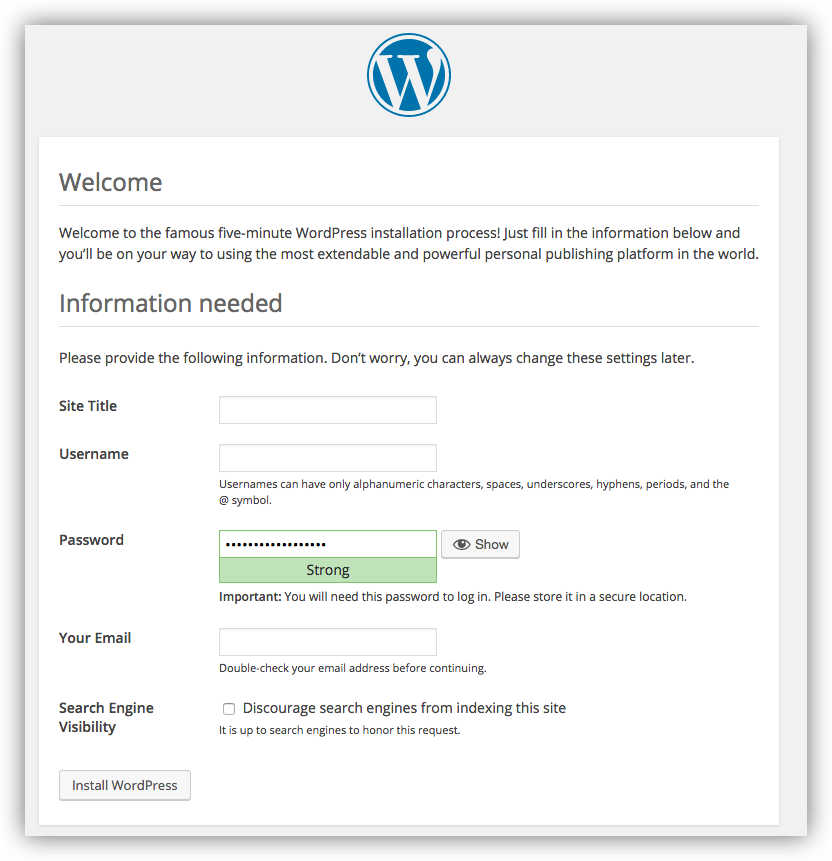

<<<<<<< HEAD
# WordPress on Kubernetes with Monitoring

A complete production-ready WordPress deployment on Kubernetes with MySQL database, NGINX Ingress, and comprehensive monitoring using Prometheus and Grafana.

## Project Overview

This project demonstrates the migration of a WordPress application from Docker Compose to Kubernetes, implementing best practices for container orchestration, persistent storage, networking, and monitoring.

### Architecture

```
┌─────────────────┐    ┌──────────────────┐    ┌─────────────────┐
│   NGINX Ingress │    │   WordPress      │    │     MySQL       │
│   Controller    │───►│   (2 replicas)   │───►│   StatefulSet   │
└─────────────────┘    └──────────────────┘    └─────────────────┘
        │                        │                       │
        │                        │                       │
        ▼                        ▼                       ▼
┌─────────────────┐    ┌──────────────────┐    ┌─────────────────┐
│  External       │    │   ClusterIP      │    │  Persistent     │
│  LoadBalancer   │    │   Service        │    │  Volume         │
└─────────────────┘    └──────────────────┘    └─────────────────┘
```

**Monitoring Stack:**
```
┌─────────────────┐    ┌──────────────────┐    ┌─────────────────┐
│   Prometheus    │    │     Grafana      │    │  AlertManager   │
│   (Metrics)     │◄──►│  (Dashboards)    │◄──►│   (Alerts)      │
└─────────────────┘    └──────────────────┘    └─────────────────┘
```

## Features

- **High Availability**: WordPress deployed with 2 replicas
- **Persistent Storage**: MySQL data persisted using StatefulSet and PVC
- **Container Registry**: Images stored in AWS ECR
- **Ingress Controller**: NGINX for external access
- **Security**: Kubernetes Secrets for sensitive data
- **Monitoring**: Complete observability with Prometheus and Grafana
- **Resource Management**: CPU and memory limits/requests configured
- **Health Checks**: Readiness and liveness probes implemented

## Prerequisites

- Kubernetes cluster (minikube, EKS, GKE, etc.)
- kubectl configured
- Helm 3.x installed
- AWS ECR access (for container images)
- Docker (for image operations)

## Quick Start

### 1. Prerequisites Setup
```bash
# Update system and install required packages
sudo yum update -y
sudo yum install git docker -y

# Start Docker
sudo systemctl start docker
sudo systemctl enable docker
sudo usermod -a -G docker ec2-user

# Install kubectl
curl -LO "https://dl.k8s.io/release/$(curl -L -s https://dl.k8s.io/release/stable.txt)/bin/linux/amd64/kubectl"
sudo install -o root -g root -m 0755 kubectl /usr/local/bin/kubectl

# Install Helm
curl https://raw.githubusercontent.com/helm/helm/main/scripts/get-helm-3 | bash

# Install minikube
curl -LO https://storage.googleapis.com/minikube/releases/latest/minikube-linux-amd64
sudo install minikube-linux-amd64 /usr/local/bin/minikube

# Start minikube
minikube start --driver=docker

# Verify installation
kubectl get nodes
helm version
```

### 2. Configure AWS ECR Access
```bash
# Install AWS CLI if not present
curl "https://awscli.amazonaws.com/awscli-exe-linux-x86_64.zip" -o "awscliv2.zip"
unzip awscliv2.zip
sudo ./aws/install

# Configure AWS credentials (replace with your credentials)
aws configure set aws_access_key_id YOUR_ACCESS_KEY
aws configure set aws_secret_access_key YOUR_SECRET_KEY
aws configure set default.region us-east-1

# Login to ECR
aws ecr get-login-password --region us-east-1 | docker login --username AWS --password-stdin 992382545251.dkr.ecr.us-east-1.amazonaws.com
```

### 3. Clone and Setup Repository
```bash
git clone <your-repo-url>
cd K8s_finalworkshop
```

### 4. Deploy NGINX Ingress Controller
```bash
helm repo add ingress-nginx https://kubernetes.github.io/ingress-nginx
helm repo update
helm install my-release ingress-nginx/nginx-ingress \
  --namespace ingress-nginx \
  --create-namespace

# Wait for controller to be ready
kubectl wait --namespace ingress-nginx \
  --for=condition=ready pod \
  --selector=app.kubernetes.io/component=controller \
  --timeout=120s
```

### 5. Deploy WordPress Application
```bash
# Create namespace and ECR secret
kubectl create namespace wordpress
kubectl create secret docker-registry ecr-secret \
  --docker-server=992382545251.dkr.ecr.us-east-1.amazonaws.com \
  --docker-username=AWS \
  --docker-password=$(aws ecr get-login-password --region us-east-1) \
  --namespace=wordpress

# Deploy WordPress stack
kubectl apply -f wordpress-deployment.yaml

# Wait for deployment to be ready
kubectl wait --for=condition=available --timeout=300s deployment/wordpress -n wordpress
```

### 6. Install Monitoring Stack
```bash
helm repo add prometheus-community https://prometheus-community.github.io/helm-charts
helm repo update
helm install monitoring prometheus-community/kube-prometheus-stack \
  --namespace monitoring \
  --create-namespace \
  --set prometheus.prometheusSpec.storageSpec.volumeClaimTemplate.spec.resources.requests.storage=2Gi \
  --set grafana.persistence.enabled=true \
  --set grafana.persistence.size=1Gi \
  --wait

# Wait for all monitoring pods to be ready
kubectl wait --for=condition=ready pod --all -n monitoring --timeout=600s
```

### 7. Verify Installation
```bash
# Check all deployments
kubectl get all -n wordpress
kubectl get all -n monitoring
kubectl get all -n ingress-nginx

# All pods should show Running status
echo "WordPress Pods:"
kubectl get pods -n wordpress
echo "Monitoring Pods:"
kubectl get pods -n monitoring  
echo "Ingress Pods:"
kubectl get pods -n ingress-nginx
```

## Accessing Services

### WordPress Application
```bash
# Port forward to WordPress
kubectl port-forward -n wordpress svc/wordpress-service 8080:80 --address=0.0.0.0
# Access: http://your-server-ip:8080
```

### Grafana Dashboard
```bash
# Get admin password
kubectl get secret -n monitoring monitoring-grafana -o jsonpath="{.data.admin-password}" | base64 --decode

# Port forward to Grafana
kubectl port-forward -n monitoring svc/monitoring-grafana 3000:80 --address=0.0.0.0
# Access: http://your-server-ip:3000 (admin/<password>)
```

### Prometheus
```bash
# Port forward to Prometheus
kubectl port-forward -n monitoring svc/monitoring-kube-prometheus-prometheus 9090:9090 --address=0.0.0.0
# Access: http://your-server-ip:9090
```

## File Structure

```
K8s_finalworkshop/
├── README.md                          # This file
├── wordpress-deployment.yaml          # Main Kubernetes manifests
├── Chart.yaml                         # Helm chart metadata
├── values.yaml                        # Helm chart default values
└── templates/
    ├── deployment.yaml                # Application deployment template
    ├── service.yaml                   # Service template
    ├── ingress.yaml                   # Ingress template
    ├── serviceaccount.yaml            # Service account template
    ├── hpa.yaml                       # Horizontal Pod Autoscaler
    ├── test-connection.yaml           # Helm test
    ├── NOTES.txt                      # Post-installation notes
    └── _helpers.tpl                   # Helm template helpers
```

## Kubernetes Resources

### WordPress Components
- **Namespace**: `wordpress` - Isolated environment
- **Deployment**: `wordpress` - 2 replicas with rolling updates
- **Service**: `wordpress-service` - ClusterIP for internal access
- **Ingress**: `wordpress-ingress` - External access via NGINX

### MySQL Database
- **StatefulSet**: `mysql` - Ensures stable network identity
- **PVC**: `mysql-pvc` - 2Gi persistent storage
- **Service**: `mysql-service` - Database connectivity
- **Secret**: `mysql-secret` - Database credentials

### Security
- **ECR Secret**: `ecr-secret` - AWS ECR authentication
- **TLS**: Ready for certificate management
- **RBAC**: Service accounts with minimal privileges

## Monitoring and Observability

### Metrics Collected
- Container uptime and restart counts
- Resource utilization (CPU, memory)
- Network traffic and latency
- Database connections and queries
- Application response times

### Grafana Dashboards
Pre-configured dashboards include:
- Kubernetes cluster overview
- Pod and container metrics
- WordPress application health
- MySQL database performance

### Key Prometheus Queries
```promql
# Container uptime
kube_pod_container_status_running{namespace="wordpress"}

# Resource usage
container_memory_usage_bytes{namespace="wordpress"}
rate(container_cpu_usage_seconds_total{namespace="wordpress"}[5m])

# HTTP response times
histogram_quantile(0.95, rate(nginx_ingress_controller_request_duration_seconds_bucket[5m]))
```

## Configuration

### Environment Variables
All sensitive data is stored in Kubernetes Secrets:
- `MYSQL_ROOT_PASSWORD`: Database root password
- `MYSQL_DATABASE`: WordPress database name
- `MYSQL_USER`: Database user
- `MYSQL_PASSWORD`: Database password
- `WORDPRESS_DB_HOST`: Database connection string

### Resource Limits
```yaml
WordPress Containers:
  requests: 256Mi memory, 100m CPU
  limits: 512Mi memory, 500m CPU

MySQL Container:
  requests: 256Mi memory, 100m CPU
  limits: 512Mi memory, 500m CPU
```

### Storage
- MySQL data: 2Gi persistent volume
- Grafana data: 1Gi persistent volume
- Prometheus data: 2Gi persistent volume

## Troubleshooting

### Common Issues

**Pods in ImagePullBackOff:**
```bash
# Check ECR authentication
kubectl describe pod <pod-name> -n wordpress
# Recreate ECR secret if needed
```

**Database Connection Failed:**
```bash
# Check MySQL pod logs
kubectl logs -n wordpress mysql-0
# Verify secret values
kubectl get secret mysql-secret -n wordpress -o yaml
```

**Ingress Not Working:**
```bash
# Check ingress controller
kubectl get pods -n ingress-nginx
# Verify ingress configuration
kubectl describe ingress wordpress-ingress -n wordpress
```

**Monitoring Not Collecting Data:**
```bash
# Check Prometheus targets
kubectl port-forward -n monitoring svc/monitoring-kube-prometheus-prometheus 9090:9090
# Visit http://localhost:9090/targets
```

### Verification Commands
```bash
# Check all resources
kubectl get all -n wordpress
kubectl get all -n monitoring

# Verify persistent volumes
kubectl get pvc -n wordpress
kubectl get pvc -n monitoring

# Check resource usage
kubectl top pods -n wordpress
kubectl top nodes
```

## Scaling and High Availability

### Horizontal Pod Autoscaling
```bash
# Enable HPA for WordPress
kubectl autoscale deployment wordpress -n wordpress --cpu-percent=70 --min=2 --max=10
```

### Database High Availability
For production, consider:
- MySQL replication setup
- Database clustering (Galera, Percona XtraDB)
- Backup and restore procedures

### Storage Considerations
- Use StorageClass with automatic provisioning
- Implement backup strategies for PVCs
- Consider distributed storage systems

## Security Best Practices

- Images scanned for vulnerabilities
- Non-root containers where possible
- Network policies for traffic isolation
- Regular secret rotation
- HTTPS/TLS termination at ingress
- Pod security policies enabled

## Production Readiness Checklist

- [ ] Resource quotas configured
- [ ] Monitoring and alerting rules set up
- [ ] Backup and disaster recovery tested
- [ ] Security scanning implemented
- [ ] Performance testing completed
- [ ] Documentation updated
- [ ] Runbooks created for operations team

## Performance Optimization

### WordPress Optimization
- PHP OPcache enabled
- Redis/Memcached for object caching
- CDN integration for static assets
- Database query optimization

### Kubernetes Optimization
- Appropriate resource requests/limits
- Pod disruption budgets
- Node affinity rules
- Persistent volume optimization

## Migration Notes

### From Docker Compose
Original docker-compose.yml components mapped to Kubernetes:

| Docker Compose | Kubernetes Equivalent |
|----------------|----------------------|
| `wordpress` service | WordPress Deployment + Service |
| `db` service | MySQL StatefulSet + Service |
| `volumes` | PersistentVolumeClaim |
| `networks` | Kubernetes networking (automatic) |
| Environment variables | ConfigMaps and Secrets |

### Breaking Changes
- Database persistence now handled by StatefulSet
- Networking uses Kubernetes services instead of Docker networks
- Secrets management through Kubernetes Secrets
- Ingress handling replaces Docker port mappings

## License

This project is licensed under the MIT License - see the LICENSE file for details.

## Support

For issues and questions:
1. Check the troubleshooting section
2. Review Kubernetes logs: `kubectl logs <pod-name> -n <namespace>`
3. Check resource status: `kubectl describe <resource-type> <resource-name> -n <namespace>`

## Contributing

1. Fork the repository
2. Create a feature branch
3. Make changes with appropriate tests
4. Submit a pull request with detailed description

---

**Author**: DevOps Workshop Project  
**Version**: 1.0  
**Last Updated**: August 2025
=======
# Quickstart: Compose and WordPress

You can use Docker Compose to easily run WordPress in an isolated environment
built with Docker containers. This quick-start guide demonstrates how to use
Compose to set up and run WordPress. Before starting, make sure you have
[Compose installed](https://docs.docker.com/compose/install/).

## Define the project

1.  Create an empty project directory.

    You can name the directory something easy for you to remember.
    This directory is the context for your application image. The
    directory should only contain resources to build that image.

    This project directory contains a `docker-compose.yml` file which
    is complete in itself for a good starter wordpress project.

    >**Tip**: You can use either a `.yml` or `.yaml` extension for
    this file. They both work.

2.  Change into your project directory.

    For example, if you named your directory `my_wordpress`:

    ```console
    $ cd my_wordpress/
    ```

3.  Create a `docker-compose.yml` file that starts your
    `WordPress` blog and a separate `MySQL` instance with volume
    mounts for data persistence:

    ```yaml
    services:
      db:
        # We use a mariadb image which supports both amd64 & arm64 architecture
        image: mariadb:10.6.4-focal
        # If you really want to use MySQL, uncomment the following line
        #image: mysql:8.0.27
        command: '--default-authentication-plugin=mysql_native_password'
        volumes:
          - db_data:/var/lib/mysql
        restart: always
        environment:
          - MYSQL_ROOT_PASSWORD=somewordpress
          - MYSQL_DATABASE=wordpress
          - MYSQL_USER=wordpress
          - MYSQL_PASSWORD=wordpress
        expose:
          - 3306
          - 33060
      wordpress:
        image: wordpress:latest
        volumes:
          - wp_data:/var/www/html
        ports:
          - 80:80
        restart: always
        environment:
          - WORDPRESS_DB_HOST=db
          - WORDPRESS_DB_USER=wordpress
          - WORDPRESS_DB_PASSWORD=wordpress
          - WORDPRESS_DB_NAME=wordpress
    volumes:
      db_data:
      wp_data:
    ```

   > **Notes**:
   >
   * The docker volumes `db_data` and `wordpress_data` persists updates made by WordPress
   to the database, as well as the installed themes and plugins. [Learn more about docker volumes](https://docs.docker.com/storage/volumes/)
   >
   * WordPress Multisite works only on ports `80` and `443`.
   {: .note-vanilla}

### Build the project

Now, run `docker compose up -d` from your project directory.

This runs [`docker compose up`](https://docs.docker.com/engine/reference/commandline/compose_up/) in detached mode, pulls
the needed Docker images, and starts the wordpress and database containers, as shown in
the example below.

```console
$ docker compose up -d

Creating network "my_wordpress_default" with the default driver
Pulling db (mysql:5.7)...
5.7: Pulling from library/mysql
efd26ecc9548: Pull complete
a3ed95caeb02: Pull complete
<...>
Digest: sha256:34a0aca88e85f2efa5edff1cea77cf5d3147ad93545dbec99cfe705b03c520de
Status: Downloaded newer image for mysql:5.7
Pulling wordpress (wordpress:latest)...
latest: Pulling from library/wordpress
efd26ecc9548: Already exists
a3ed95caeb02: Pull complete
589a9d9a7c64: Pull complete
<...>
Digest: sha256:ed28506ae44d5def89075fd5c01456610cd6c64006addfe5210b8c675881aff6
Status: Downloaded newer image for wordpress:latest
Creating my_wordpress_db_1
Creating my_wordpress_wordpress_1
```

> **Note**: WordPress Multisite works only on ports `80` and/or `443`.
If you get an error message about binding `0.0.0.0` to port `80` or `443`
(depending on which one you specified), it is likely that the port you
configured for WordPress is already in use by another service.

### Bring up WordPress in a web browser

At this point, WordPress should be running on port `80` of your Docker Host,
and you can complete the "famous five-minute installation" as a WordPress
administrator.

> **Note**: The WordPress site is not immediately available on port `80`
because the containers are still being initialized and may take a couple of
minutes before the first load.

If you are using Docker Desktop for Mac or Docker Desktop for Windows, you can use
`http://localhost` as the IP address, and open `http://localhost:80` in a web
browser.




### Shutdown and cleanup

The command [`docker compose down`](https://docs.docker.com/engine/reference/commandline/compose_down/) removes the
containers and default network, but preserves your WordPress database.

The command `docker compose down --volumes` removes the containers, default
network, and the WordPress database.

## More Compose documentation

* [Docker Compose overview](https://docs.docker.com/compose/)
* [Install Docker Compose](https://docs.docker.com/compose/install/)
* [Getting Started with Docker Compose](https://docs.docker.com/compose/gettingstarted/)
* [Docker Compose Command line reference](https://docs.docker.com/compose/reference/)
* [Compose file reference](https://docs.docker.com/compose/compose-file/)
* [Awesome Compose WordPress sample](../../wordpress-mysql/README.md)
>>>>>>> 0b6b3c4 (commit 09012025)
